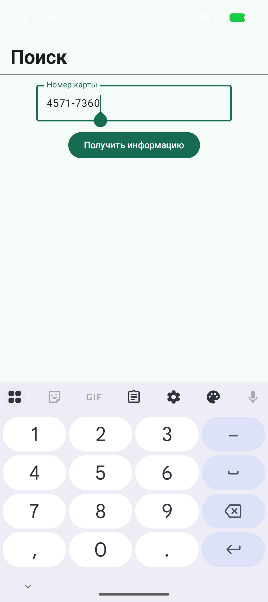

# TestBinlist

Приложение для загрузки информационных данных по первым 8 цифрам банковской карты (BIN — Bank Identification Number).

Данные выгружаются с открытого API [binlist.net](https://binlist.net/).

---

## 📱 Скриншоты

<p>
  
  
</p>

---

## 🛠 Стек технологий

| Категория | Технология |
|-----------|-----------|
| **UI** | Jetpack Compose, Compose Navigation |
| **DI** | Koin |
| **Network** | Ktor Client |
| **Database** | Room |
| **Async** | Kotlin Coroutines, StateFlow |
| **Architecture** | MVVM |

---

## 🏗 Архитектура

```
┌─────────────┐     ┌─────────────┐     ┌─────────────┐
│     UI      │────▶│  ViewModel  │────▶│  UseCase    │
│  (Compose)  │◀────│  (StateFlow)│◀────│             │
└─────────────┘     └─────────────┘     └──────┬──────┘
                                               │
                                        ┌──────┴──────┐
                                        │  Repository │
                                        └──────┬──────┘
                                               │
                                        ┌──────┴──────┐
                                        │   Ktor /    │
                                        │   Room      │
                                        └─────────────┘
```

---

## 🚀 Установка

```bash
git clone https://github.com/lodrean/TestBinlist.git
cd TestBinlist
./gradlew assembleDebug
```

---

## ✅ TODO

- [x] Добавить скриншоты
- [x] Добавить Unit-тесты
- [x] История поиска
- [ ] Кэширование запросов (offline-first)
- [ ] Поддержка dark mode

---

## 📄 Лицензия

MIT License
